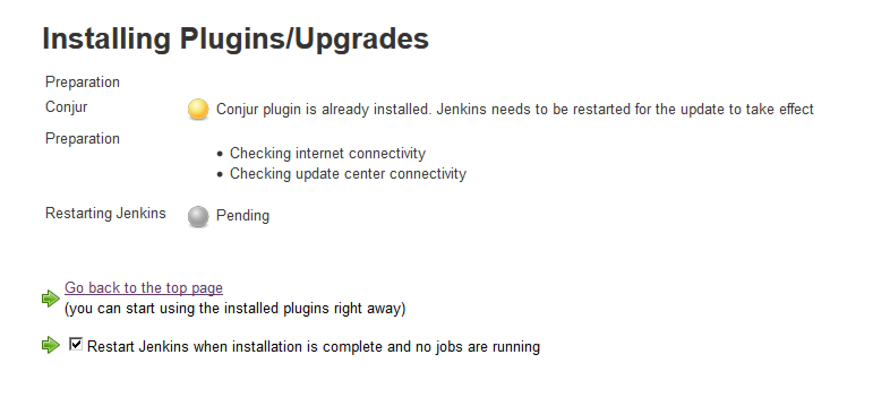

# Contributing to the conjur credentials plugin

## Building from Source

To build the plugin from source, Maven is required. Build it like this:

```bash
git clone https://github.com/jenkinsci/conjur-credentials-plugin
cd conjur-credentials-plugin
mvn clean install
```

## Installing from Binaries

As another option, you can use the latest .hpi found under the binaries folder.

### Install in Jenkins

When you have the .hpi file, log into Jenkins as an administrator.
Then go to **Jenkins** -> **Manage Jenkins** -> **Manage Plugins** -> **Advanced**.
In the **Upload Plugin** section, browse for the .hpi and upload it to Jenkins:


After installing the plugin, restart Jenkins:


