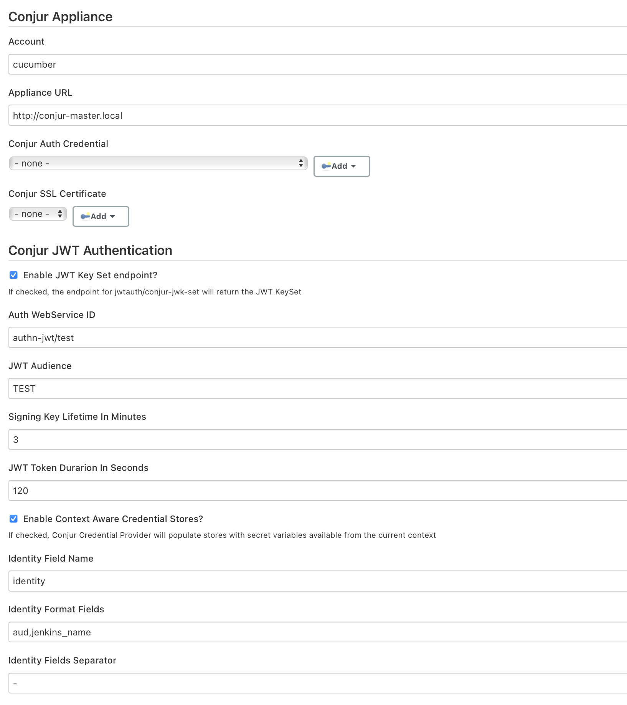
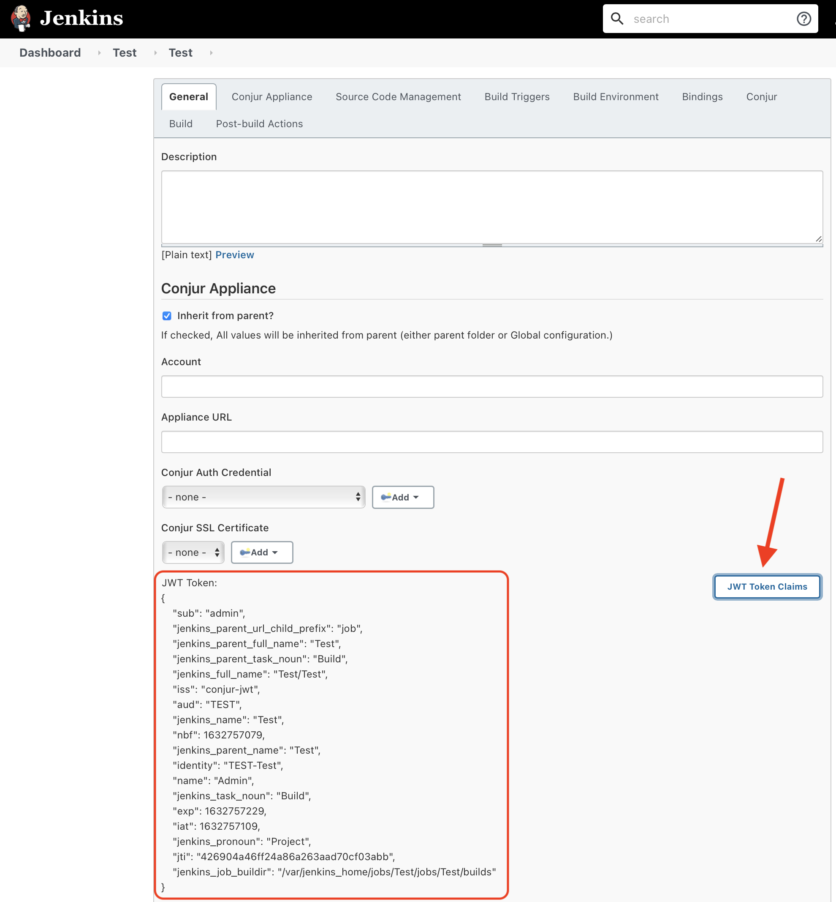
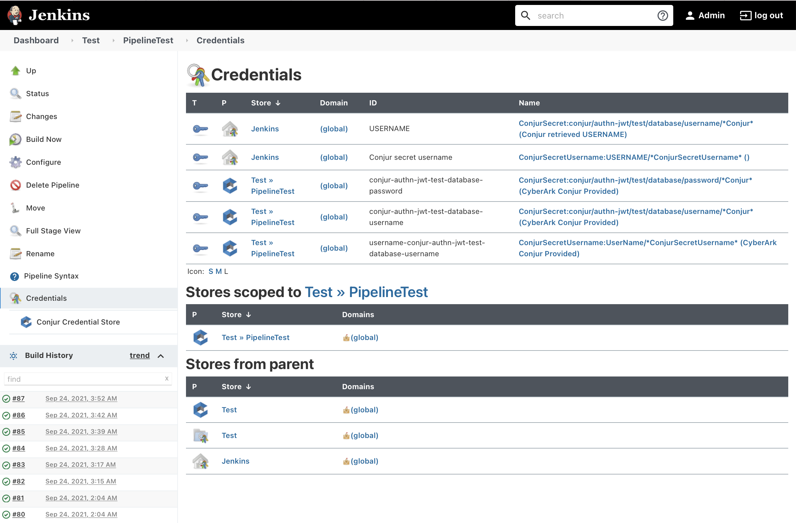
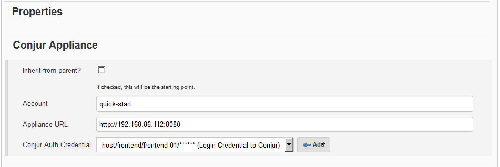
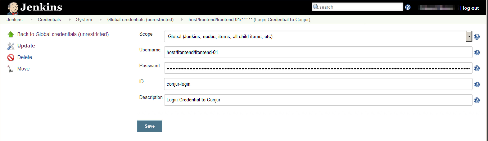
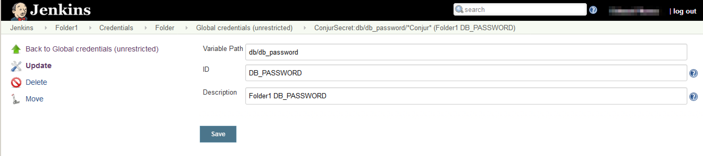
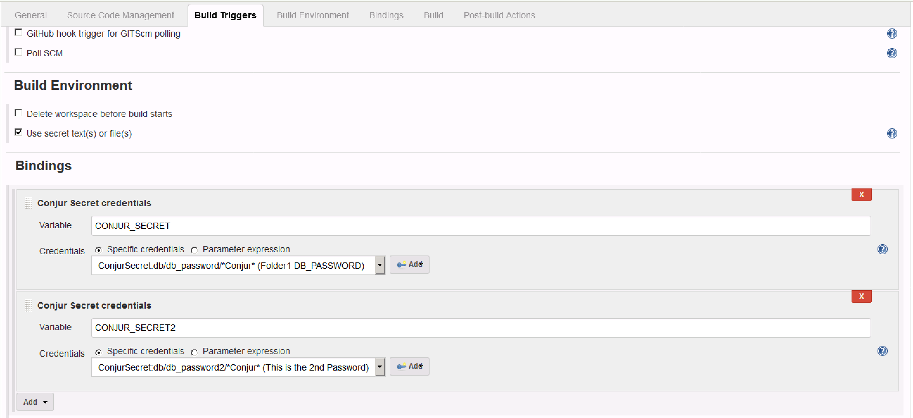

[](https://ci.jenkins.io/blue/organizations/jenkins/Plugins%2Fconjur-credentials-plugin/activity/)

# conjur-credentials-plugin

This Conjur plugin securely provides credentials that are stored in Conjur to Jenkins jobs.  

## Reference

* [SECURING SECRETS ACROSS THE CI/CD PIPELINE](https://www.conjur.org/use-cases/ci-cd-pipelines/)
* [CI/CD Servers Know All Your Plumbing Secrets](https://www.conjur.org/blog/ci-cd-servers-know-all-your-plumbing-secrets/)

## Usage

Install the plugin using Jenkins "Plugin Manager" with an administrator account. After installing the plugin and restarting Jenkins, you are ready to start. 

### Global Configuration

A global configuration allows any job to use the configuration, unless a folder-level configuration overrides the global configuration. Click the **Global Credentials** tab.

 Define the Conjur Account and Appliance URL to use.



### Global Configuration: Conjur JWT Authentication

Please read the [documentation for JWT Authenticator ](https://docs.cyberark.com/Product-Doc/OnlineHelp/AAM-DAP/Latest/en/Content/Operations/Services/cjr-authn-jwt.htm?tocpath=Integrations%7CJWT%20Authenticator%7C_____0)

You can enable the use of JWT Authentication by checking "Enable JWT Key Set Endpoint", this will allow the plugin provide an endpoint for the JWKS_URI (described in the documentation link).  
The JWT Key Set Endpoint will be: BASEURLFORJENKINS/jwtauth/conjur-jwk-set

Once enabled, any job that runs from Jenkins where a Conjur Login Credential has not been provided, the conjur-credentials plugin will automatically generate a JWT Token based on the context of the execution which can be served as authentication mechanism. The token signature will be validated with the JWT Key set exposed by the endpoint.

You need to define the following as well:

* Auth WebService ID: The Service ID of your JWT Authenticator webservice. [See doc here](https://docs.cyberark.com/Product-Doc/OnlineHelp/AAM-DAP/Latest/en/Content/Developer/Conjur_API_JWT_Authenticator.htm). This could be either the service id or authenticator_type/service_id (authn-jwt/id)
* JWT Audience: the aud value in the JWT Token
* Signing Key Lifetime in Minutes: For how long will the signing key for JWT Tokens will be valid, and exposed via the JWT key set endpoint
* JWT Token Duration In Seconds: This will the lifetime of any JWT token generated via the conjur-credentials plugin
* Identity Field Name: Additional field added to the claims of the JWT token, which could be a combination of other fields. This value could potentially be used as the identity of the execution. 
* Identity Format Fields: Comma separated list of JWT Claim fields to be concatenated for the value of the Identity Field. 
* Identity Fields Separator: The character(s) to be used in the concatenation of the format fields. 
* Enable Context Aware Credential Stores: Please see following section. 

**Note:** CyberArk recommends keeping the token and key TTL values the minimum possible based on context. 

### How to obtain JWT Token Claims

In the configuration page of the item (project, job, foler, etc) you will find the "JWT Token Claims" button, clicking on it will show the JWT Token claims for the item based on the context where it is. 



This information can be used by the Conjur Security Administrator to grant access to credentials. 


### Global Configuration: Context Aware Credential Stores  (Conjur Credentials Provider)

When Context Aware Credential Stores is enabled, the conjur-credentials plugin will act as a Credential Provider and populate stores with the available secrets/variables based on the current context of the navigation. For this feature, JWT Authentication is used and the JWT Key Set Endpoint needs to be enabled. The credentials provided by the context aware store are available to be used as if they were defined statically.



#### Annotations for secrets/variables

You can add annotations in your Conjur policy to expand the credentials available through the Context Aware Credential Store. 

For any secret variable in Conjur available to the context a "Conjur Secret Credential" credential will be exposed. 

With the following annotations: 
* jenkins_credential_type: if set to `usernamecredential` an additional credential (of type "Conjur Secret Username Credential") with a prefix of "username-" will be added. Otherwise, if set to "usernamesshkeycredential" the additional credential of type "Conjur Secret Username SSHKey Credential" with a prefix of "usernamesshkey-" will be exposed.
* jenkins_credential_username: To define the username to be used when either usernamecredential" or "usernamesshkeycredential" is set for jenkins_credential_type. 

Here an example:

```yaml
      - !variable
        id: database/password
        annotations:
          jenkins_credential_username: system
          jenkins_credential_type: manager
```

### Folder/Job Property Configuration

To set the Conjur appliance information at the folder level, cLick the **FolderLevel** tab.

If the checkbox "Inherit from parent?" is checked, the values set here are ignored, and values are taken from the parent folder.  If all folders up the hierarchy are set to inherit from its parent, the global configuration is used.



Requests to Conjur will fail unless:

* An SSL certificate is specified in the SSL certificate field.
  **Note**: The SSL Certificate can be linked to a certificate already stored in Jenkins (defined as credentials).
* There is a certificate locally defined in the cacerts of the JVM sending the requests
* Conjur is not set up to use SSL.


### Conjur Login Credential (In case of not using JWT Authentication)

The first step is to store the credential required for Jenkins to connect to Conjur. Click the **Credentials** tab.

Define the credential as a standard "Username with password" credential. In the example below, the credentials are a Conjur host and its API key:

* **Username** is host/frontend/frontend-01. The host must already be defined as a host in Conjur policy.
* **Password** is the API key for that host. The API key is the value returned by Conjur when the host is loaded in policy.




### Conjur Secret Definition (Static)

The secrets that you want to obtain from Conjur can be defined explicitly. Use the **ConjurSecret** tab to define secrets. Define them as credentials of kind "Conjur Secret Credential", "Conjur Secret Username Credential" or "Conjur Secret Username SSHKey Credential".



### Usage from a Jenkins pipeline script

To reference Conjur secrets in a Jenkins script, use `withCredentials` and the symbol `conjurSecretCredential`, `conjurSecretUsername` or `conjurSecretUsernameSSHKey`.

Here some examples showing how to fetch the secret from a Jenkins job pipeline definition.


```groovy
node {
   stage('Work') {
      withCredentials([conjurSecretCredential(credentialsId: 'DB_PASSWORD', 
                                              variable: 'SECRET')]) {
         echo 'Hello World $SECRET'
      }
   }
   stage('Results') {
      echo 'Finished!'
   }
}
```


```groovy
node {
   stage('Work') {
      withCredentials([conjurSecretUsernameSSHKey(credentialsId: 'username-conjur-authn-jwt-test-database-password', 
                                              usernameVariable: "USERNAME", secretVariable: "SECRET")]) {
         echo 'Hello World $USERNAME $SECRET'
      }
   }
   stage('Results') {
      echo 'Finished!'
   }
}
```


```groovy
node {
   stage('Work') {
      withCredentials([conjurSecretUsername(credentialsId: 'username-conjur-authn-jwt-test-database-password', 
                                              usernameVariable: "USERNAME", passwordVariable: "SECRET")]) {
         echo 'Hello World $USERNAME $SECRET'
      }
   }
   stage('Results') {
      echo 'Finished!'
   }
}
```


### Usage from a Jenkins Freestyle Project

To bind to Conjur secrets, use the option "Use secret text(s) or file(s)" in the "Build Environment" section of a Freestyle project.



Secrets are injected as environment variables to the build steps of the project.

## License

This repository is licensed under Apache License 2.0 - see [`LICENSE`](LICENSE) for more details.
